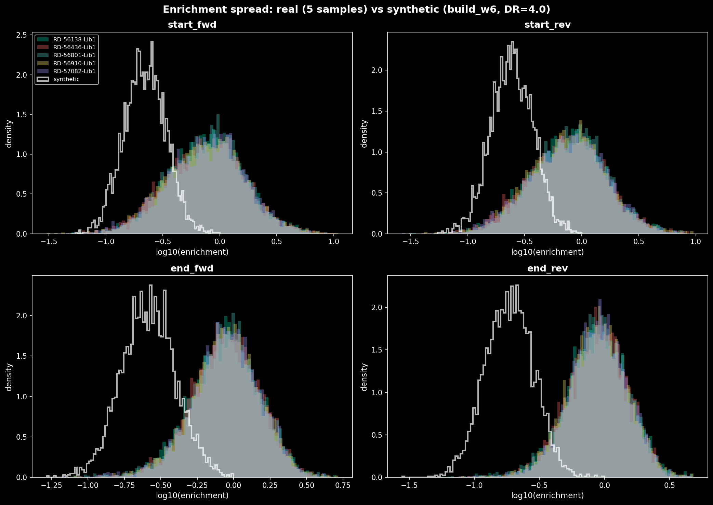
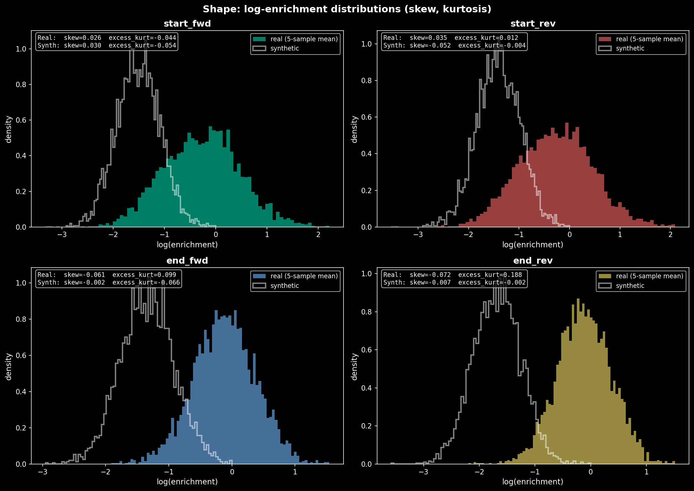
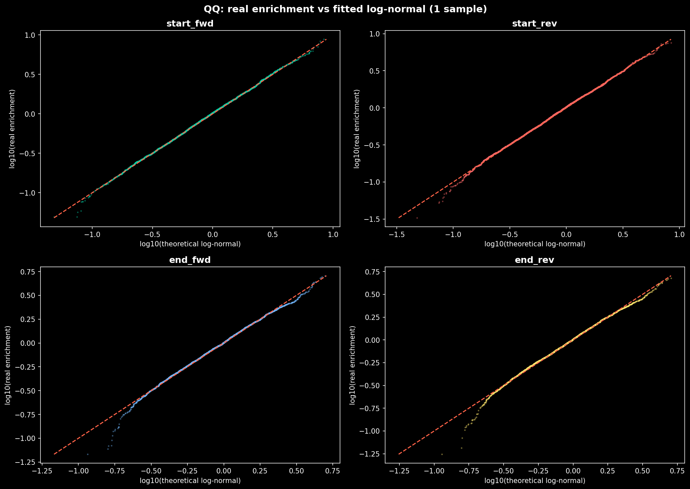
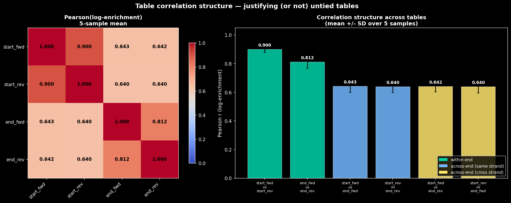
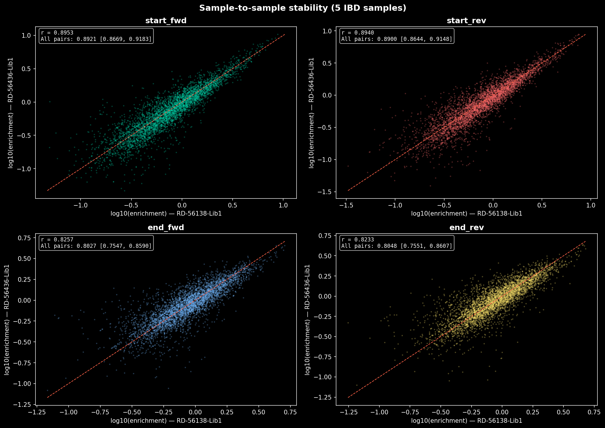
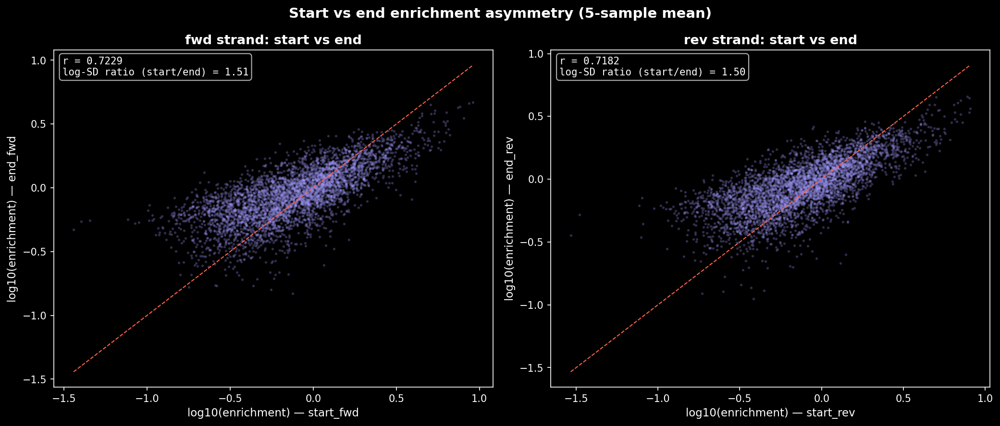
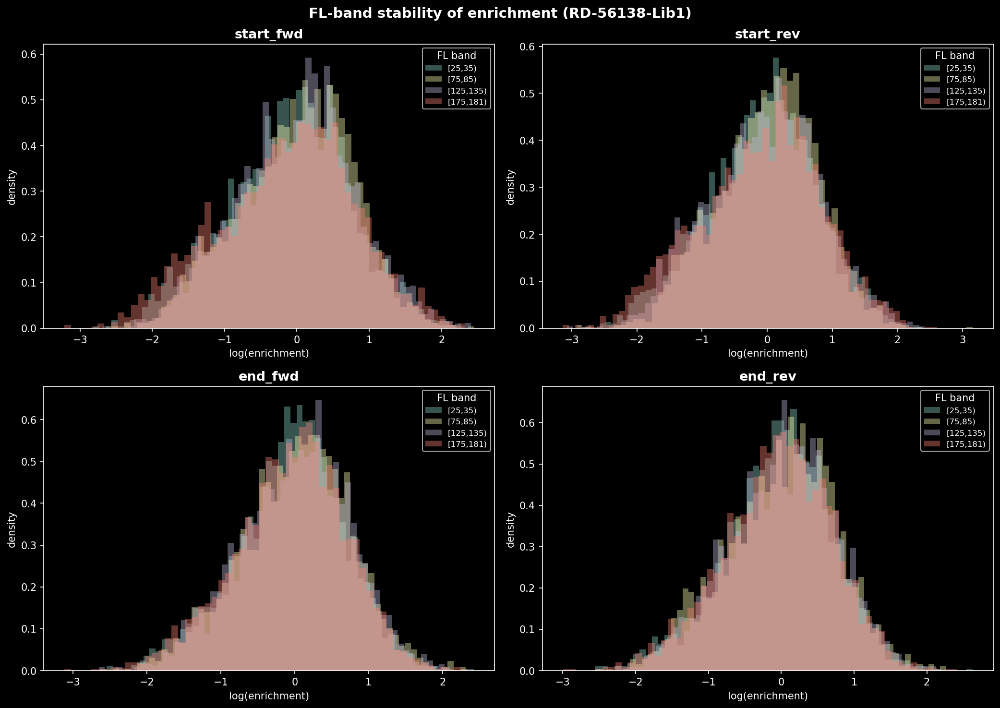

# Cut-Site Hexamer Counts

> **Retired code (owner decision 189, 2026-10-09).** The scripts and tests this
> document names are in `attic/hexamer_prior_pipeline/` and no longer run. The
> findings below stand as a record of the 92-sample containment-admission
> tables. The live per-sample counter is `scripts/measure_cut_site_hexamers.py`,
> which uses the simulator's start-in-region admission, so its counts are not
> comparable with these. See that directory's README.

`scripts/count_cut_site_hexamers.py` counts de-duplicated cut-site hexamer
frequencies from real fragment h5 files. It is a counting tool, not analysis:
it emits observed counts and matching background (all-candidate) counts, and
the consumer decides what to divide by what. Its output is the real-data
replacement for the simulator's synthetic `build_w6` hexamer tables (decision
78).

## Output

**Location:** `/efs/analytics/nathanboley/background_model/cut_site_hexamers/`

One `.parquet` per sample. (`.npz` files also exist at this path but are not
produced by the committed script.)

### Parquet schema

| Column | Type | Description |
|---|---|---|
| `hexamer` | `string` | The 6-mer string (see orientation below) |
| `table` | `string` | One of `start_fwd`, `end_fwd`, `start_rev`, `end_rev` |
| `band_lo` | `int32` | Fragment-length band lower edge (inclusive) |
| `band_hi` | `int32` | Fragment-length band upper edge (exclusive) |
| `observed` | `int64` | Count from de-duplicated, filtered fragments |
| `background` | `int64` | Count from all candidate fragments in the generative domain |

**Row count:** 262,144 per file (4 tables x 16 bands x 4,096 hexamers).

Provenance metadata is embedded in the Parquet file-level metadata under the
key `count_cut_site_hexamers_meta`. `read_output(path)` returns
`(dataframe, meta)`.

### Hexamer orientation

The `hexamer` column is written 5'->3' along the strand of the fragment:

- `start_fwd` / `end_fwd` -- reference-forward 6-mer at the cut site.
- `start_rev` / `end_rev` -- **reverse complement** of the reference-forward
  6-mer. Do not RC these again when joining.

## Per-Sample Results

These 5 samples were drawn from a 36-row sheet; see *Sample selection* below,
which pins the exact sheet and recipe. Region set:
`quiet_v2_pad1200_repeats_removed_tile2560.bed` (11,505 tiles).

All values below are from the Parquet file-level metadata, verified against
the code's filter pipeline.

| Sample | Fetched | MAPQ removed | De-dup'd | Dup rate | Counted | Elapsed |
|---|---|---|---|---|---|---|
| RD-56138-Lib1 | 5,991,138 | 21.07% | 1,010,217 | 78.64% | 857,675 | 195 s |
| RD-56436-Lib1 | 5,256,294 | 14.39% | 764,320 | 83.02% | 687,063 | 185 s |
| RD-56801-Lib1 | 1,791,578 | 7.42% | 586,316 | 64.65% | 529,810 | 328 s |
| RD-56910-Lib1 | 4,641,928 | 17.30% | 979,412 | 74.49% | 853,407 | 191 s |
| RD-57082-Lib1 | 2,039,921 | 7.81% | 508,574 | 72.96% | 452,365 | 335 s |

**Column definitions:**

- **Fetched** -- fragments returned by `h5.fetch_array` across all regions
  (a fragment spanning two tiles is fetched in both, so this double-counts
  at tile boundaries).
- **MAPQ removed** -- `(fetched - mapq_pass) / fetched`.
- **De-dup'd** -- fragments surviving MAPQ filter + `(contig, start, stop)`
  dedup.
- **Dup rate** -- `dup_removed / mapq_pass`.
- **Counted** -- fragments that additionally pass containment, length range,
  and both-cut-sites-valid checks. Each contributes one start and one end
  count.
- **Elapsed** -- `count_sample()` wall time (the Parquet metadata field
  `stats.elapsed_s`).

## Method

### Filter pipeline (in order)

1. **MAPQ:** `min(mapq_read1, mapq_read2) >= 10` (inclusive `>=`, matching
   `PlumbingConfig.min_mapq`). A file where MAPQ was never carried through
   stores unknown MAPQ as `-1`; the script detects all-removed and aborts.
2. **De-duplication:** collapse fragments sharing `(contig, start, stop)` to
   one molecule. Strand is **not** part of the key (matches
   `FragmentArray.drop_duplicate_fragments()`). The strand-inclusive duplicate
   rate is recorded as a diagnostic.
3. **Containment:** `gstart <= start` and `stop <= gstop` -- fully contained.
   A fragment straddling a tile boundary falls out of both tiles.
4. **Length range:** `[25, 180]` inclusive (from `background_model.constants.L_MIN`,
   `L_MAX`, derived from `tracks.FL_BANDS`; formerly `cut_site_stats`, and before
   that `simulator.weights`, now in `attic/pre_rewrite_simulator/`).
5. **Valid cut sites:** both the 5' and 3' hexamer windows must be fully ACGT.

### Cut-site geometry

A fragment at `[start, stop)` has cut sites at positions `start` and `stop`
(not `stop - 1`). `stop` in the h5 is already exclusive, so no +/-1 adjustment.

- Plus strand: `c5 = start`, `c3 = stop`; both index `hex_fwd`.
- Minus strand: `c5 = stop`, `c3 = start`; both index `hex_rc`.

The hexamer at cut site `c` spans `seq[c-3 : c+3]` (3 bases inside the
fragment, 3 outside).

### Background tables

`background` holds the same four hexamer tables computed over every candidate
fragment in the generative domain -- all `(position, length, strand)` where
the fragment is fully contained and both cut sites are valid. Computed in
closed form via cumulative sums, not by enumerating candidates.

### Band stratification

16 half-open bands of width 10 bp over `[25, 181)`. The final band is
`[175, 181)` (6 lengths, not 10). Band edges are recorded in each row, so a
consumer joins on `(band_lo, band_hi)` rather than assuming uniform widths.

## Design Rationale

### String-keyed hexamers (decision 81)

The Parquet key is the literal 6-mer string, not a bare 4,096-element array
ordered by an implicit integer code. A mismatched k-mer ordering between
producer and consumer makes every downstream weight wrong, but `sum(w) = 1`
still holds -- normalisation cannot detect a relabelling. With string keys a
convention mismatch fails to *join* instead of silently misaligning.

### Single vocabulary source

`hexamer_vocabulary()` is defined in exactly one live place
(`background_model/hexamers.py`, since 2026-10-09) and imported by this script.
A second ordering would silently invalidate every comparison. Until that date
there were two copies, in `simulator/precompute.py` and
`simulator/count_hexamers_rdf.py`. They were verified identical. The first is
now in `attic/pre_rewrite_simulator/`, and the second became `hexamers.py`.

## Sample selection — reproducible, but only against a pinned sheet

The five samples were drawn with stdlib `random`, not `np.random.default_rng`,
because NumPy guarantees stream stability only for the legacy `RandomState`.
The counting script itself contains no RNG and is entirely deterministic; the
seed applies to the *selection*, not the counting.

Verified reproduction — all three elements are required:

```python
random.Random(20260929).sample(sorted(names), 5)
# -> RD-56138-Lib1, RD-56436-Lib1, RD-56801-Lib1, RD-56910-Lib1, RD-57082-Lib1
```

where `names` is the `sample_name` column of the **36-row** sheet preserved at
`/efs/analytics/nathanboley/background_model/cut_site_hexamers/sample_sheet_36row_for_seeded_draw.tsv`.

**Two ways this silently returns the wrong five:**

- **Omit `sorted()`** and the same seed over the same sheet yields a different
  five (only `RD-56910-Lib1` overlaps). Nothing errors.
- **Use the current sheet.** `data/sample_sheets/ibd_quiescent.resolved.tsv`
  now holds **213** rows after a resolver change; the same seed over it draws a
  different five. The seed is reproducible only against a stated sheet version.

The five names above are the authoritative record — prefer them over re-running
the draw.

---

## Real vs synthetic hexamer distributions

Enrichment = `observed / background` per hexamer, summed across all 16 FL
bands before dividing (count-weighted collapse). Normalised within each table
to mean 1 so that enrichment is a relative quantity. The synthetic comparison
uses `build_hexamer_tables(seed, dynamic_range=4.0)` from
`scripts/run_simulator.py` — the function and default the simulator used **when
this comparison was made**. That is the previous-generation simulator, now in
`attic/pre_rewrite_simulator/scripts/run_simulator.py` (decision 171). The live
simulator draws no synthetic tables: it takes `r(h)` measured from real data
(`docs/pending/simulator_spec.md`), so "simulator" in this section means the
retired one. It draws four tables in sequence from one generator, untied by design.
(`scripts/sim_fragments.py::build_w6` is the retired sampler's equivalent and
is *not* what runs; it is unimportable anyway, since `scripts/` is not a package
and importing it drags in the whole old simulator.)

**What the band collapse hides:** any fragment-length-dependent variation in
hexamer preference. A hexamer favoured at short lengths but not long ones gets
averaged out proportionally to each band's fragment count. The synthetic tables
have no band structure, so this is the only like-for-like comparison possible.
Fig 7 shows that the enrichment distribution is stable across representative FL
bands, so the collapse is not masking a major effect.

Script: `scripts/analyze_hexamer_distributions.py`. Figures:
`docs/pending/cut_site_hexamer_plots/`.

### 1. Spread



| Table | Real p95/p5 | Real min/max DR | Syn p95/p5 | Syn min/max DR | Real log-SD | Syn log-SD |
|---|---|---|---|---|---|---|
| start_fwd | 11.35x | 253x | 4.03x | 18.6x | 0.739 | 0.423 |
| start_rev | 11.17x | 276x | 4.05x | 18.3x | 0.733 | 0.428 |
| end_fwd | 5.07x | 31.5x | 4.02x | 19.2x | 0.491 | 0.425 |
| end_rev | 4.96x | 40.8x | 3.99x | 35.9x | 0.489 | 0.427 |

The start tables are **~1.7x wider** in log-space than synthetic (log-SD 0.74
vs 0.42). The end tables are close to synthetic (log-SD 0.49 vs 0.43). The
min/max dynamic range of the start tables (253--276x) dwarfs the synthetic
(18--19x), but min/max is driven by extreme hexamers and is noisy; p95/p5 is
the stable measure.

**Start/end asymmetry is a structural gap.** Start-site bias (5' cut) has ~50%
more spread in log-space than end-site bias (3' cut). The simulator draws all
four tables with a single `dynamic_range`, so every table gets log-SD ~0.42 and
the asymmetry is absent by construction.

### 2. Shape



| Table | Real skew | Real excess kurt | Syn skew | Syn excess kurt |
|---|---|---|---|---|
| start_fwd | +0.026 | -0.044 | +0.030 | -0.054 |
| start_rev | +0.035 | +0.012 | -0.052 | -0.004 |
| end_fwd | -0.061 | +0.099 | -0.002 | -0.066 |
| end_rev | -0.072 | +0.188 | -0.007 | -0.002 |

The log-normal assumption holds well: skewness is near zero for all tables
(|skew| < 0.08), and excess kurtosis is small (< 0.2). The end tables show
slightly heavier tails (positive excess kurtosis ~0.1--0.2) than the synthetic,
but the effect is minor. No multi-modality is visible.



The QQ plots confirm: real enrichments track their fitted log-normal closely,
with mild departures only in the extreme tails.

### 3. Correlation structure across the four tables



| Category | Pair | Pearson r (mean +/- SD) |
|---|---|---|
| Within-end | start_fwd vs start_rev | 0.900 +/- 0.021 |
| Within-end | end_fwd vs end_rev | 0.812 +/- 0.044 |
| Across-end (same strand) | start_fwd vs end_fwd | 0.643 +/- 0.043 |
| Across-end (same strand) | start_rev vs end_rev | 0.640 +/- 0.041 |
| Across-end (cross strand) | start_fwd vs end_rev | 0.642 +/- 0.039 |
| Across-end (cross strand) | start_rev vs end_fwd | 0.640 +/- 0.045 |

Within-end correlation (0.81--0.90) is clearly higher than across-end
(~0.64), and the gap is consistent across all 5 samples. This **supports
untied tables**: a hexamer's bias at the 5' cut is more similar across strands
than it is between the 5' and 3' cuts. The across-end correlations are nearly
identical regardless of strand pairing (same-strand ~0.64, cross-strand ~0.64),
so the 5'/3' distinction is the real axis of variation, not strand.

**The (previous-generation) simulator sits at the opposite extreme.**
`build_hexamer_tables` in `scripts/run_simulator.py` (now under
`attic/pre_rewrite_simulator/`) draws four tables in sequence from one generator —
untied by design — so they are mutually **independent**: measured mean |r|
**0.011** (seed 42) and **0.013** (seed 1337) across all six pairs, i.e. zero
within noise.

| | within-end r | across-end r |
|---|---|---|
| real | 0.81 – 0.90 | ~0.64 |
| simulator | ~0.01 | ~0.01 |

So the sim **understates** table coupling rather than overstating it. Real
tables share substantial structure — even the most distant pair sits at 0.64 —
while the sim gives a model no shared structure to find. A model that exploits
cross-table correlation earns no credit in sim, and the within-end vs
across-end distinction cannot be tested there at all, because in sim there is
no distinction to recover.

### 4. Sample-to-sample variability



| Table | Pairwise r (mean) | Min | Max |
|---|---|---|---|
| start_fwd | 0.892 | 0.867 | 0.918 |
| start_rev | 0.890 | 0.864 | 0.915 |
| end_fwd | 0.803 | 0.755 | 0.859 |
| end_rev | 0.805 | 0.755 | 0.861 |

The hexamer tables are a **stable target** across samples: pairwise
log-enrichment correlations are 0.80--0.92.

**Start tables are NOT more stable than end tables — that reading is a noise
artifact.** Merging a pair of samples and randomly re-splitting the fragments
at the same depth ratio (binomial thinning) gives the correlation attributable
to sampling noise alone:

| table | observed r | thinning-null r | disattenuated r |
|---|---|---|---|
| start_fwd | 0.8826 | 0.8977 | 0.983 |
| start_rev | 0.8831 | 0.8956 | 0.986 |
| end_fwd | 0.7988 | 0.8166 | 0.978 |
| end_rev | 0.7905 | 0.8148 | 0.970 |

The **noise ceiling itself** differs between start and end (0.90 vs 0.82),
because start tables have wider spread (log-SD 0.74 vs 0.49) and the same
Poisson noise degrades a wider signal less. Once corrected for attenuation
(`r_obs / r_null`), start and end are equally stable at **0.97--0.99**.

**Observed correlation sits at the noise ceiling, marginally below it.** Two
real samples are almost exactly as similar as two random halves of one pool, so
the *underlying* tables are nearly identical across samples and the real
between-sample variation is small — the ~0.013--0.024 shortfall below the null.

Never read a raw between-sample correlation here without its thinning null: at
these depths the null is 0.82--0.90, not 1.0, so an uncorrected number mostly
measures depth and spread rather than biology.



The start-vs-end scatter (log-SD ratio ~1.50) confirms the asymmetry is a
stable feature of the biology, not a sample artifact.

### 5. FL-band stability



Enrichment distributions are visually similar across representative FL bands
([25,35), [75,85), [125,135), [175,181)), confirming that the band collapse
does not mask a major length-dependent shift in hexamer preference.

### Disagreement with coordination-file numbers

The coordination file claimed: start tables span 152--361x enrichment, end
tables 53--86x, within-end r = 0.85--0.92, across-end r = 0.58--0.71.

Measured from the Parquets:
- **Start DR**: 253x and 276x (5-sample mean). Single-sample first sample:
  179x and 228x. The 152--361x range is plausible as a per-sample spread but
  was not verified against the coordination file's methodology.
- **End DR**: 31.5x and 40.8x (5-sample mean). Single-sample first sample:
  75x and 86x. The coordination file's 53--86x matches the per-sample range;
  the 5-sample mean is lower because averaging shrinks extremes.
- **Within-end r**: 0.812--0.900. Consistent with the claimed 0.85--0.92 for
  start (0.900), but the end table (0.812) falls below 0.85.
- **Across-end r**: 0.640--0.643. Within the claimed 0.58--0.71 range.

No dramatic disagreement. The coordination file's numbers appear broadly
correct; differences are methodological (mean-of-samples vs per-sample
extremes).

### Verdict: is the synthetic prior realistic?

**Partially. The end tables are well-approximated; the start tables are not.**

The log-normal shape assumption is sound — real enrichments are approximately
log-normal in all four tables, with near-zero skew and small excess kurtosis.

The critical mismatch is **spread**: the synthetic `dynamic_range=4.0`
produces log-SD ~0.42, which matches the end tables (log-SD ~0.49) reasonably
but underestimates the start tables (log-SD ~0.74) by 1.7x. A sim-derived
"% bias captured" number therefore **overestimates recovery at start sites**
(the model faces a narrower distribution than reality) and is approximately
correct at end sites.

The second gap is **structural**: the simulator uses one table for all four
positions, while the real data shows clear within-end vs across-end correlation
structure (r ~0.85 vs ~0.64) and a 1.5x start/end log-SD asymmetry. The sim
cannot test whether a model recovers these distinctions.

**What transfers from sim to real:**
- Shape of the distribution (log-normal, low skew/kurtosis)
- End-table difficulty (spread is similar)
- General architecture validation (untied tables, strand symmetry)

**What does not transfer:**
- Start-table recovery percentages (too easy in sim)
- Any conclusion about start/end differentiation (sim has no asymmetry)
- Absolute "% bias captured" as a proxy for real-data performance

---

## Sparsity, and feeding these tables into the simulator

Both mismatches above would be fixed by using the real tables as the
simulator's input, since spread and correlation are properties of the data.
The obstacle is count depth.

**Per sample, collapsed over all 16 FL bands:**

| table | obs == 0 | obs < 10 | obs < 100 | median | CV at median |
|---|---|---|---|---|---|
| start_fwd | 22 | 505 | 2,545 | 69 | 12.0% |
| start_rev | 16 | 495 | 2,567 | 69 | 12.0% |
| end_fwd | 6 | 434 | 2,344 | 86 | 10.8% |
| end_rev | 16 | 458 | 2,317 | 86 | 10.8% |

About **60% of hexamers carry under 100 counts** in a single sample.

**Pooled over all 5 samples:**

| table | obs == 0 | obs < 10 | median | CV at median |
|---|---|---|---|---|
| start_fwd | 1 | 58 | 270 | 6.1% |
| start_rev | 0 | 49 | 271 | 6.1% |
| end_fwd | 0 | 34 | 347 | 5.4% |
| end_rev | 1 | 37 | 348 | 5.4% |

The only hexamers reaching zero when pooled are `CGCGTA` and `CGTACG` —
CpG-dense, so plausibly real depletion rather than undersampling.

**Band-resolved tables are not usable.** A single FL band has 570–1,184 zero
hexamers and up to 3,928 under 10 counts. Only the band-collapsed form has the
depth to support a per-hexamer estimate.

`background == 0` never occurs, so `observed / background` is always defined —
every hexamer does occur in the region set.

### What this implies for using them

Architecturally the swap is already supported: the manifest stores the
**realised** tables rather than a recipe, so real tables travel in the h5 the
same way synthetic ones do, and `HexamerTables` is just four arrays.

**Table scale does not need solving.** `start_s` enters `w` as `start_s[h]/S_s`
and `end_s` via `E/Z`, so both are scale-invariant by the Appendix-A structure;
only relative values matter.

Two things do need deciding, and both are statistical rather than plumbing:

- **Zeros.** A zero-count hexamer yields zero weight, making that cut site
  undrawable — a structural hole the synthetic tables do not have.
- **Per-sample noise.** At 12% CV, per-sample tables used raw would bake our own
  sampling error into the simulation as if it were biology.

The thinning null above bounds the answer: real between-sample variation is
small (disattenuated r 0.97–0.99), so a pooled prior with per-sample posteriors
should shrink hard, leaving per-sample tables as small perturbations. A prior
also dissolves the zeros. Design pending.
