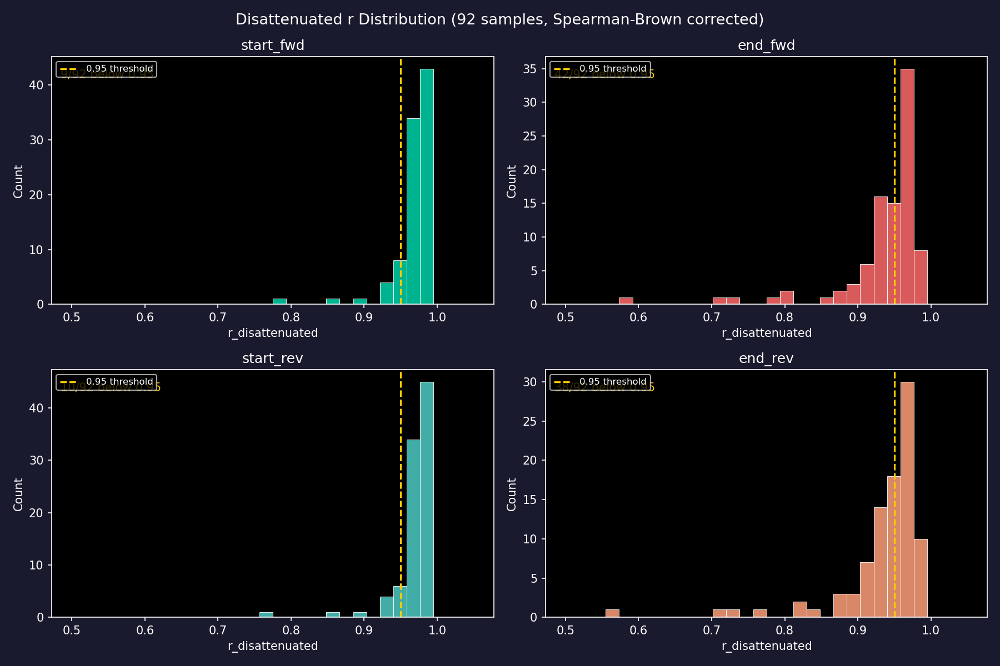
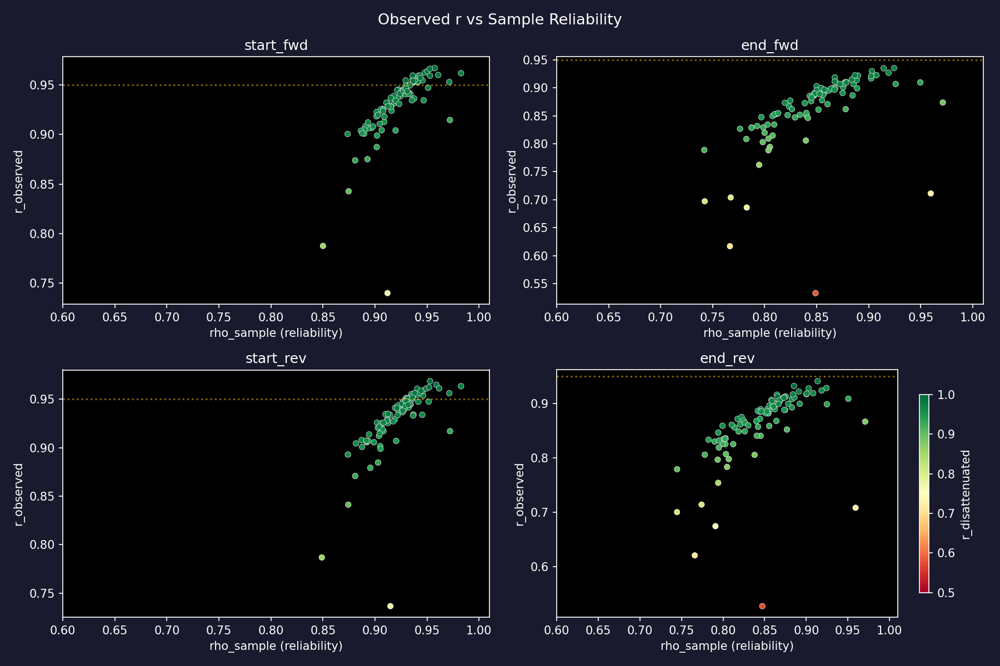
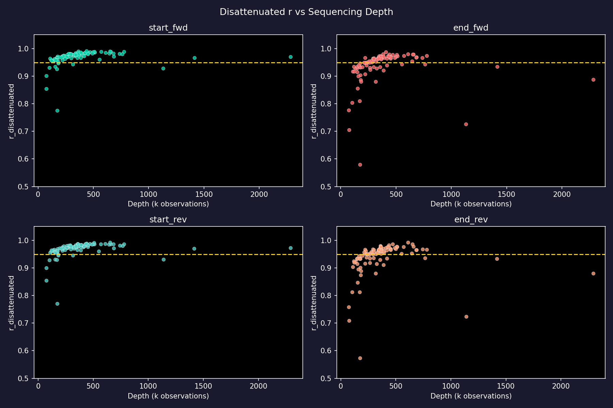
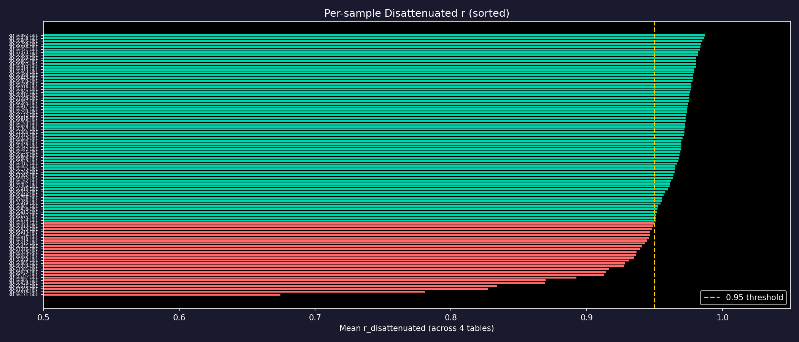

# Hexamer Prior Disattenuation Measurement: 92-Sample Cohort

## What this measures

Shrinkage trades variance for bias. The Dirichlet-multinomial posterior pulls
each sample's hexamer weights toward the pooled prior, attenuating the
sample's real deviation from the cohort along with its noise. Before using
a specific sample's posterior in the simulator, we need to know: **how much
of the true sample-vs-pool difference survives the shrinkage?**

This report measures the **disattenuated Pearson correlation** between each
sample's raw hexamer log-enrichment and the leave-one-out (LOO) pooled
log-enrichment, for all 4 tables (start_fwd, end_fwd, start_rev, end_rev),
across all 92 samples in the cohort.

## Methodology

The estimator reuses the thinning-null approach from commit ef60d52, which
established pairwise disattenuation for these same tables (documented in
`docs/pending/cut_site_hexamer_counts.md`).

For each (sample, table) pair:

1. **Leave-one-out pool**: Subtract the sample's counts from the pooled counts
   to avoid correlating a sample with a pool that contains it.

2. **Observed r**: Pearson correlation of log(obs_proportion / bg_proportion)
   between the sample and the LOO pool, over all hexamers where both are > 0.

3. **Thinning-null reliability (rho_sample)**: Binomial-thin the sample's
   counts (p = 0.5) into two halves, compute log-enrichment for each half,
   correlate them. Average over 50 replications. The raw split-half correlation
   estimates the reliability of a **half-depth** measurement; the
   **Spearman-Brown step-up** `rho_full = 2 * rho_half / (1 + rho_half)` is
   applied so the returned value refers to the full-depth measurement. This
   is the standard correction for split-half reliability (Spearman 1910,
   Brown 1910).

4. **LOO pool reliability (rho_pool_loo)**: Same thinning + step-up procedure
   on the 91-sample LOO pool. At ~34M pooled counts, this is 0.997–0.999.

5. **Disattenuated r**: `r_observed / sqrt(rho_sample * rho_pool_loo)`,
   clamped to [-1, 1]. This estimates what the sample-vs-pool correlation
   would be if both were measured with infinite depth.

**Why log-enrichment**: the precedent doc uses log-enrichment throughout.
The log transform stabilises variance across the 250x dynamic range of start
tables; Pearson on raw weights would be dominated by a handful of extreme
hexamers.

**Implementation**: `scripts/measure_hexamer_disattenuation.py`. Tested by
`tests/test_hexamer_disattenuation.py` (10 tests on synthetic data with known
ground truth).

## Results

### Summary statistics

| Table | Median r_obs | Median rho_sample | Median rho_pool_loo | Median r_disatt | Samples at 1.0 | Below 0.99 | Below 0.95 |
|-------|-------------|-------------------|---------------------|-----------------|----------------|------------|------------|
| start_fwd | 0.9395 | 0.9249 | 0.9989 | 0.9755 | 0/92 | 89/92 | 9/92 |
| end_fwd | 0.8803 | 0.8486 | 0.9978 | 0.9542 | 0/92 | 92/92 | 42/92 |
| start_rev | 0.9390 | 0.9262 | 0.9989 | 0.9760 | 0/92 | 90/92 | 10/92 |
| end_rev | 0.8822 | 0.8529 | 0.9978 | 0.9545 | 0/92 | 91/92 | 38/92 |

With the Spearman-Brown step-up, the reliability estimates are higher (median
rho_sample ~0.92 for start vs ~0.85 for end, up from ~0.86 and ~0.74 without
step-up), which raises the denominator of the disattenuation ratio and
eliminates the saturation artefact entirely: **0 of 368 rows now sit at the
1.0 clamp** (previously 295/368 = 80%). No pre-clamp values exceed 1.0.

66 of 92 samples (72%) have mean r_disattenuated ≥ 0.95 across all 4 tables.

### End tables are more attenuated than start tables

End tables have 4–5x as many samples below 0.95 per table (38–42 vs 9–10).
This is consistent with the prior finding (ef60d52) that end tables have lower
spread (log-SD 0.49 vs 0.74 for start), so the same counting noise degrades
them more and the noise ceiling is lower: median rho_sample is 0.85 for end
vs 0.93 for start.

### Outlier samples

26 samples have mean r_disattenuated < 0.95 (up from 9 in the pre-step-up
measurement). The increase is the expected direction: the previous measurement
had 80% of values clamped at 1.0, masking real deviations that are now visible.

The top 10 most deviant:

| Sample | Mean r_disatt | Min r_disatt (table) | Depth (N) | Mean rho | Assessment |
|--------|--------------|---------------------|-----------|----------|------------|
| RD-56171-Lib1 | 0.675 | 0.573 (end_rev) | 173k | 0.881 | **Severe** — genuinely different hexamer profile |
| RD-56818-Lib1 | 0.781 | 0.705 (end_fwd) | 75k | 0.808 | **Severe** — low depth, deviation persists after correction |
| RD-57090-Lib1 | 0.827 | 0.724 (end_rev) | 1,132k | 0.966 | **Severe** — high depth, high reliability, real deviation |
| RD-56676-Lib1 | 0.834 | 0.759 (end_rev) | 74k | 0.831 | **Moderate** — low depth, end tables hit hardest |
| RD-56428-Lib1 | 0.869 | 0.805 (end_fwd) | 103k | 0.826 | **Moderate** — end tables only |
| RD-56905-Lib1 | 0.870 | 0.810 (end_fwd) | 171k | 0.819 | **Moderate** — end tables only |
| RD-56687-Lib1 | 0.892 | 0.847 (end_rev) | 154k | 0.848 | **Moderate** — end tables only |
| RD-56161-Lib1 | 0.913 | 0.880 (end_fwd) | 316k | 0.879 | **Mild** — moderate depth |
| RD-56429-Lib1 | 0.914 | 0.874 (end_rev) | 182k | 0.854 | **Mild** — end tables only |
| RD-57081-Lib1 | 0.916 | 0.880 (end_fwd) | 183k | 0.856 | **Mild** — end tables only |

**RD-57090-Lib1** and **RD-56805-Lib1** (mean 0.928, depth 2,282k, rho 0.977)
are especially informative because they have very high depth and very high
reliability. Their deviation from the pool is measured with high confidence —
these are not depth-starved samples where noise might be masquerading as
biology.









## What this licenses and what it does not

### What it licenses

1. **For 66/92 samples (72%), the posterior is a reliable estimate.**
   Their mean disattenuated r is ≥ 0.95 across all 4 tables, meaning
   the sample-vs-pool correlation after correcting for measurement noise
   is high. Using their posterior weights in the simulator is safe.

2. **For the remaining 26 samples, the posterior weights still carry the
   sample's signal**, just partially attenuated toward the pool. The shrinkage
   ratio (23–29% at the median) means ~75% of each sample's deviation from
   the pool is preserved.

3. **The prior itself is sound.** Pool reliability is 0.997–0.999 across
   tables — the pooled hexamer weights are measured with negligible noise.

### What it does not license

1. **For 26 samples with mean r_disatt < 0.95, the posterior is a biased
   estimator of the true sample-specific hexamer weights.** Their real hexamer
   profiles differ from the pool, and the shrinkage has pulled them partway
   toward a pool they don't fully belong to. The bias is in the direction of
   the pool: the posterior underestimates how different these samples truly are.

2. **This measurement does not tell us whether the bias matters for the
   downstream simulator output.** The hexamer weights enter the simulator
   through cut-site probabilities. A 5–10% attenuation in log-enrichment
   correlation may or may not produce a detectable difference in simulated
   fragment pileups — that depends on how sensitive the pileup shape is to
   hexamer weight perturbations, which is a separate question.

3. **The three most extreme outliers (RD-56171, RD-56818, RD-57090) are
   potentially unsuitable for pooled-prior simulation.** Their end-table
   r_disatt of 0.57–0.72 means the posterior has been pulled substantially
   toward a pool that does not represent them. If simulation fidelity for
   these specific samples matters, they may need a stronger sample-specific
   component (higher weight on their own data, or a subgroup prior).

4. **The reliability estimate is conservative (overestimates reliability)
   because binomial thinning is less noisy than real count processes.**
   Real hexamer counts are overdispersed relative to the Poisson (the
   Dirichlet-multinomial model exists precisely because they are), but the
   binomial thinning null assumes Poisson-like splitting. This means the
   thinning reliability overestimates the true measurement reliability, which
   pushes r_disatt DOWN (the denominator is too large), and samples are
   over-flagged. Note that this opposes the Spearman-Brown correction (which
   had been omitted and pushed r_disatt UP), so the two biases partly offset.
   Both are stated here rather than one being waved at as cancelling the other.

### The per-sample gate

For any new sample being simulated:
```python
from scripts.measure_hexamer_disattenuation import (
    measure_sample_disattenuation, load_measurement_results,
)
from scripts.build_hexamer_prior import load_artifact

# From pre-computed results (instantaneous):
results = load_measurement_results(
    "/efs/analytics/nathanboley/background_model/cut_site_hexamers/disattenuation_92samples.tsv"
)
sample_rows = results[results["sample_name"] == "RD-56436-Lib1"]
# Check: all tables have r_disattenuated > threshold

# Or compute fresh for a new sample not in the cohort:
art = load_artifact("hexamer_prior_92samples.json")
result = measure_sample_disattenuation(
    art, sample_obs, sample_name="NEW-SAMPLE",
    leave_one_out=False,  # sample is not part of this pool
)
```

## Artifact

Results TSV: `/efs/analytics/nathanboley/background_model/cut_site_hexamers/disattenuation_92samples.tsv`
(368 rows = 92 samples x 4 tables, tab-separated)

Columns: `sample_name`, `table`, `r_observed`, `rho_sample`, `rho_sample_se`,
`rho_pool_loo`, `rho_pool_loo_se`, `r_disattenuated`, `leave_one_out`,
`sample_total_obs`.

## Reproducibility

- Artifact: `hexamer_prior_92samples.json` (92-sample Dirichlet-multinomial fit)
- Cohort: `cohort92_resolved_paths.tsv`
- Script: `scripts/measure_hexamer_disattenuation.py`
- Tests: `tests/test_hexamer_disattenuation.py` (10 tests, synthetic data)
- 50 thinning replications per (sample, table), deterministic seeds
- Spearman-Brown step-up applied to split-half reliability
- Python 3.10, scipy, numpy, pandas
