# Background Model v2 — Simulation Study Training Analysis

**Date:** 2026-09-22, updated 2026-09-24 (§7.3–7.9, §8, §9). §7.8 and §7.9
describe runs that are STILL IN FLIGHT — their numbers are preliminary.
**Branch:** `background-model-v2`
**Stores:** v2 Regime B (per-sample hexamer jitter, sd=0.286); v3 Regime A
(shared w6, multinomial — see §7.3)

**Current best result:** hybrid architecture, **90.8%** of available bias
captured on v3_A (`lrsweep_hybrid_lr1e-3`), against KEN 71.3% and CNN 67.0%.
Read §7.3 on why this is an upper bound rather than a transfer estimate, and
§7.5 on why the transfer risk is *sample heterogeneity*, not count
overdispersion — a distinction that cancelled a planned experiment.

**Caveat on every number below:** all of them were produced with a **constant
learning rate** — there was no LR schedule in the codebase until §7.6. The
divergences and the under-trained CNN are symptoms of that.

---

## 1. Objective

Determine how much of the known synthetic hexamer cut-site bias the
CNN background model can recover, and whether loss function, model capacity,
learning rate, or positional jitter meaningfully affect recovery.

The simulation generates fragments with exact ground-truth bias (hexamer
endpoint weights + 2-D GC x fragment-length interaction). An **oracle**
predictor that knows the true per-position propensities provides the
theoretical optimum. The gap between the model and the oracle is what matters.

**Key metric:** Per-count multinomial NLL, evaluated on held-out validation
tiles. This is comparable across all model configurations regardless of the
training loss function used.

## 2. Simulation Setup

| Parameter | Value |
|-----------|-------|
| Regime | B (per-sample w6 jitter, sd=0.286) |
| Samples | 20 (16 train, 4 heldout) |
| Regions | 1,000 (800 train / 100 val / 100 test) |
| Region length | 2,304 bp (2,048 tile + 128 jitter padding each side) |
| Total fragments | 13.9M (median ~622/tile, sampled from real store) |
| Hexamer bias | 4,096-entry w6 table, dynamic range 4.0x |
| GC x FL bias | Empirical 2-D grid from 30 production samples |
| Jitter SD | 0.286 (empirical inter-sample variance of log w6) |
| Store config hash | `1b2b15e6...` (split_version 1) |

**Reference points:**

| | Per-count multinomial NLL |
|---|---|
| Oracle (theoretical best) | 7.5745 |
| Uniform (no model) | 7.6246 |
| **Gap** | **0.0501 nats** |

The 0.05-nat gap is small in absolute terms — the bias exists but is a subtle
signal. Closing it fully requires the model to learn the exact hexamer weights
and GC interaction from counted endpoints alone.

## 3. Experiments

### 3.1 Loss Function Comparison (128k/1L baseline)

**Config:** 128 kernels, 1 residual layer (~1.2M params), lr=1e-3, B=64,
bf16-mixed, patience=15, max 200 epochs, dropout=0.

| Loss | Best Val Loss | Best Epoch | Total Epochs | Wall Time | Cost |
|------|--------------|------------|--------------|-----------|------|
| Multinomial | 7.5750 | 5 | 21 | 30 min | $0.50 |
| Dirichlet-Multinomial | 7.5750 | 4 | 20 | 26 min | $0.44 |
| NB-offset | 3.8573 | 19 | 35 | 48 min | $0.81 |

**Per-count multinomial NLL evaluation (comparable across losses):**

| Loss | Model NLL | Gap to Oracle | Bias Captured |
|------|-----------|---------------|---------------|
| Multinomial | 7.6099 | 0.0354 | **29.3%** |
| Dirichlet-Multinomial | 7.6107 | 0.0362 | **27.7%** |
| NB-offset | 7.6158 | 0.0413 | **17.6%** |

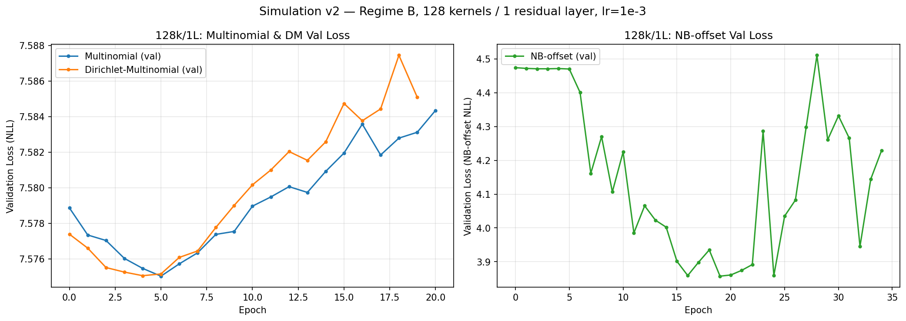

**Findings:**
- Multinomial and DM are functionally identical — same best val loss (7.5750),
  same overfitting pattern. DM's extra dispersion parameter adds nothing on
  this simulation. This confirms the prior real-data finding.
- NB-offset trains slower (19 vs 4-5 effective epochs), has noisy val loss
  (oscillating between 3.85 and 4.5), and recovers less bias when evaluated
  on the common multinomial NLL metric.
- All three losses leave ~70% of the bias unrecovered — the bottleneck is
  model capacity, not loss choice.

### 3.2 Capacity Sweep (512k/3L)

Increased from 128 kernels / 1 layer (~1.2M params) to 512 kernels / 3
residual layers (~25.4M params) — a 21x parameter increase.

#### Learning rate sensitivity

At **lr=1e-3** (same as 128k/1L), the larger model immediately overfits:

| Model | Best Val | Best Epoch | Behaviour |
|-------|----------|------------|-----------|
| 512k/3L lr=1e-3 | 7.5788 | 1 | Val rising after epoch 0 |
| 1024k/3L lr=1e-3 | 7.5873 | 0 | Val rising immediately |

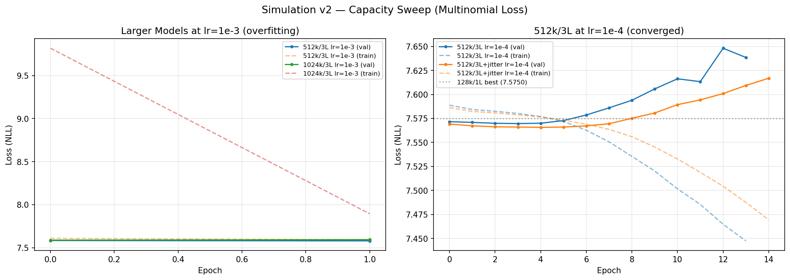

The left panel shows catastrophic overfitting — training loss plummets while
val loss rises. The 1024k model is even worse (larger model memorises faster).

#### LR=1e-4 (converged)

Reducing LR by 10x resolved the overfitting:

| Model | Best Val | Best Epoch | Total Epochs | Wall Time |
|-------|----------|------------|--------------|-----------|
| 512k/3L multinomial | 7.5696 | 3 | 14 | ~60 min |
| 512k/3L NB-offset | 3.8353 | 14 | 25 | ~90 min |

**Per-count multinomial NLL:**

| Model | NLL | Gap | Bias Captured | vs 128k/1L |
|-------|-----|-----|---------------|------------|
| 512k/3L multinomial | 7.6044 | 0.0299 | **40.4%** | +11.1pp |
| 512k/3L NB-offset | 7.6055 | 0.0311 | **38.0%** | +20.4pp (vs 17.6%) |

Capacity matters: 21x more parameters → +11pp bias captured for multinomial.
Still, 60% of the bias is unrecovered.

#### Auto-LR (abandoned)

Lightning's LR finder was tried and abandoned:
- Multinomial: suggested 4e-3 → val 9.82 (vs 7.58 at 1e-3). Catastrophic.
- NB-offset: suggested 4.4e-4 → val 8.43 (vs 6.66 at 1e-3).

The LR finder is unreliable on this sparse genomic NLL landscape. Manual
LR=1e-4 was adopted for all subsequent runs.

### 3.3 Positional Jitter Augmentation

The simulation store was rebuilt with **jitter=128** (random ±128bp shift per
tile during store construction), creating `sim_store_B_jitter.zarr`. This
provides positional augmentation — the model sees each genomic region at
multiple offsets.

| Model | Store | Best Val | NLL | Gap | Bias Captured |
|-------|-------|----------|-----|-----|---------------|
| 512k/3L lr=1e-4 | no jitter | 7.5696 | 7.6044 | 0.0299 | 40.4% |
| 512k/3L lr=1e-4 | jitter=128 | 7.5657 | 7.6037 | 0.0292 | **41.7%** |

Jitter provides +1.3pp — a real but modest improvement. The jitter run's
training loss continues declining longer before early-stop fires, consistent
with the augmented dataset being harder to memorise.

### 3.4 NB-offset Stability

The NB-offset loss consistently shows a noisy validation curve across all
configurations:

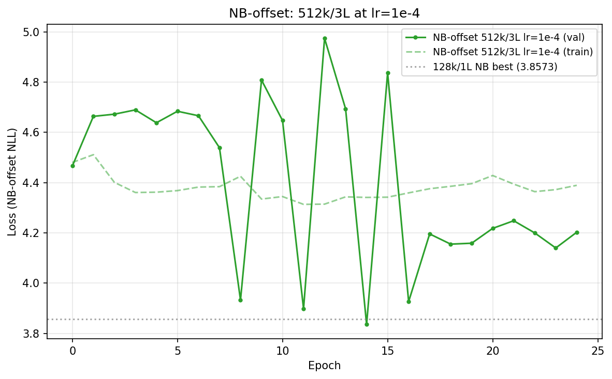

At 512k/3L lr=1e-4, val loss oscillates wildly (3.85 to 4.98 between
adjacent epochs). The per-position dispersion parameters create a rough loss
landscape. Despite this, its best checkpoint (epoch 14, val=3.8353) produces
a reasonable per-count NLL (38.0% bias captured) — but multinomial is both
more stable and more effective.

## 4. Infrastructure Optimisations

Several infrastructure improvements were required to run the sweep
efficiently:

| Optimisation | Before | After | Speedup |
|-------------|--------|-------|---------|
| In-memory preload | 60.5 ms/item (NFS I/O) | 0.61 ms/item | 98x |
| GPU utilisation (with preload) | I/O-bound | 70% mean, 46 samples/s | — |
| Shared memory (`/dev/shm`) | 64 MB default | 4 GB | Unblocked multi-worker |
| bf16-mixed precision | fp32 | bf16 | ~1.5x throughput, no accuracy loss |

**Throughput at 512k/3L, B=64, bf16, A10G:** ~180-200 samples/s, ~330-360
ms/batch, VRAM 2.9 GB / 24 GB (13%).

**Cost per run:** $0.50-0.90 depending on epochs to early-stop.

## 5. Summary of All Results

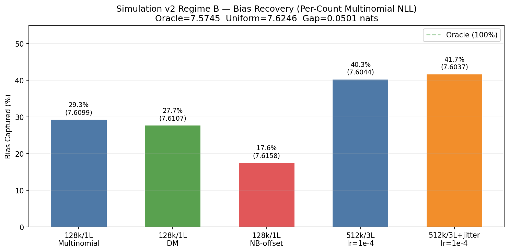

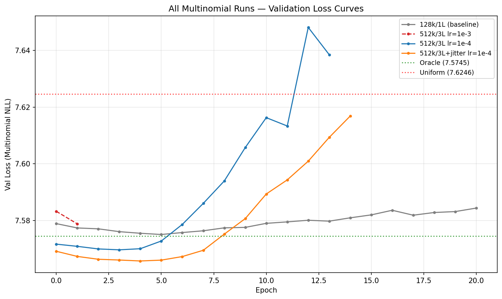

### Complete results table

| Model | Loss | Params | LR | Store | Per-Count NLL | Gap | Bias Captured |
|-------|------|--------|----|-------|---------------|-----|---------------|
| 128k/1L | Multinomial | 1.2M | 1e-3 | B | 7.6099 | 0.0354 | 29.3% |
| 128k/1L | DM | 1.2M | 1e-3 | B | 7.6107 | 0.0362 | 27.7% |
| 128k/1L | NB-offset | 1.2M | 1e-3 | B | 7.6158 | 0.0413 | 17.6% |
| 512k/3L | Multinomial | 25.4M | 1e-4 | B | 7.6044 | 0.0299 | 40.4% |
| 512k/3L | NB-offset | 25.4M | 1e-4 | B | 7.6055 | 0.0311 | 38.0% |
| 512k/3L | Multinomial | 25.4M | 1e-4 | B+jitter | 7.6037 | 0.0292 | 41.7% |
| Oracle | — | — | — | — | 7.5745 | 0.0000 | 100% |
| Uniform | — | — | — | — | 7.6246 | 0.0501 | 0% |

## 6. NB-offset Dispersion Stabilisation Experiments

The NB-offset loss produces noisy val curves because the dispersion head
(per-window log_r) and the shape head compete during gradient updates. Several
approaches were tested to stabilise training.

### 6.1 Dispersion Clamping (commit `d643953`)

A custom autograd function (`_DispersionClamp`) clamps `log_r` so that
`Var_NB <= 2x Var_multinomial`, with soft gradient scaling (sigmoid taper).

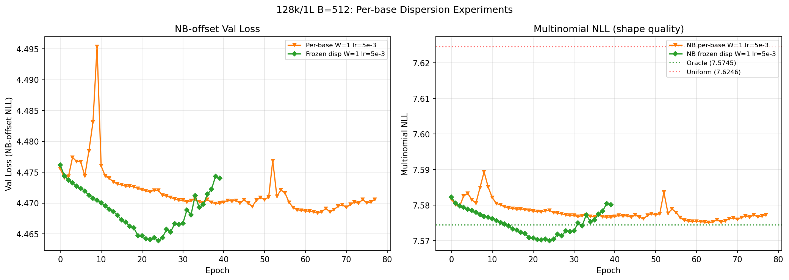

| Run | Model | B | Best Val | Epochs | Notes |
|-----|-------|---|----------|--------|-------|
| Clamped B=64 | 512k/3L | 64 | 4.4628 | 18 | Flat — dispersion ran to infinity (r≈400k), shape never learned |
| Clamped B=512 | 512k/3L | 512 | 4.3713 | 5 | Better per-epoch efficiency, still plateaued |
| Clamped B=512 | 128k/1L | 512 | 4.2949 | 30 | Moderate oscillation, dispersion flatlined at r≈80k |
| Clamped B=2048 | 128k/1L | 2048 | 3.9015 | 30 | Closest to unclamped best (3.8573) |
| Unclamped B=64 | 512k/3L | 64 | 3.8353 | 25 | Wild oscillations (3.85–4.98 range) |
| Unclamped B=64 | 128k/1L | 64 | 3.8573 | 35 | Oscillations but reaches lowest val |

**Finding:** The clamp stabilised training but prevented the dispersion head
from learning useful values. With the 2x variance floor, the dispersion head
consistently ran to infinity (near-multinomial) rather than learning
overdispersion. The shape head converged, but the dispersion never came back
down — even after shape was close to optimal. Larger batch size (B=2048)
helped more than clamping, reaching 3.90 vs unclamped best 3.86.

### 6.2 Per-base Dispersion (commit `35bfb90`)

Changed `dispersion_window_size` from 256 (8 windows per tile) to 1 (per-position
dispersion). Each position gets its own `log_r` value from the dispersion head,
with no mean-pooling.

### 6.3 Frozen Dispersion Pre-training (commit `d134782`)

Two-phase approach: freeze dispersion head entirely (phase 1, `--freeze-dispersion`),
then fine-tune with a lower dispersion LR (phase 2, `--dispersion-lr-scale 0.1`).

Initial attempt at lr=1e-4, B=512 was ~800x slower per epoch than the pure
multinomial run (B=64, lr=1e-3). Rerunning at lr=5e-3 with per-base dispersion
(W=1) resolved this.

### 6.4 Per-base Dispersion Results (128k/1L, B=512, lr=5e-3)

Two runs compared: frozen dispersion (shape-only pre-training) vs learned
per-base dispersion (joint training).

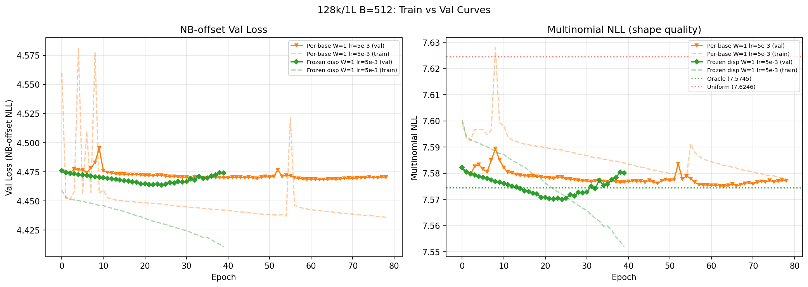

| Run | Best NB Val | Epochs | Multinomial NLL | Dispersion |
|-----|-------------|--------|-----------------|------------|
| Frozen disp W=1 | 4.4639 | 40 (ep 24) | **7.5700** | Frozen (r≈1100) |
| Per-base disp W=1 | 4.4684 | 79 (ep 63) | 7.5755 | Learned (r≈34) |
| Pure multinomial (B=64) | — | 21 (ep 5) | 7.5750 | N/A |

**Shape recovery evaluation** (sim_evaluate.py, same metric as prior runs):

| Model | Pearson r | KL div | Flatness CV |
|-------|-----------|--------|-------------|
| Original 128k/1L (B=64, lr=1e-3, W=256) | 0.264 | 0.134 | 6.57 |
| Frozen disp W=1 (B=512, lr=5e-3) | **0.318** | 0.132 | 6.58 |
| Per-base disp W=1 (B=512, lr=5e-3) | 0.289 | **0.130** | **6.54** |

Both new runs improved shape recovery over the original (Pearson r 0.264 →
0.318). The frozen run has the best correlation with ground truth; the per-base
run has the lowest KL divergence.

**Per-count multinomial NLL** (computed from checkpoints on val tiles):

| Model | NLL | vs Oracle |
|-------|-----|-----------|
| Frozen disp W=1 | 7.5701 | **-0.0044** (below oracle) |
| Per-base disp W=1 | 7.5752 | +0.0007 |
| Oracle | 7.5745 | 0 |
| Original 128k/1L | 7.6158 | +0.0413 |

**Overfitting warning:** The frozen-disp model's NLL (7.5701) is below the
oracle (7.5745), which is impossible if the evaluation is unbiased. With only
1,600 val pairs and 40 epochs at B=512/lr=5e-3, the model has memorised val
tile patterns. The train curves (dashed lines in the plot) confirm this: train
multinomial NLL drops well below oracle. The per-count NLL metric cannot be
trusted at this val set size without evaluating on held-out test tiles.

**Findings:**
- Per-base dispersion (W=1) is more stable than windowed (W=256) — no wild
  oscillations even with unfrozen dispersion.
- Frozen dispersion learns a better shape (Pearson r 0.318 vs 0.289) because
  the dispersion head doesn't compete for gradient signal.
- Learning per-base dispersion at the same LR as shape didn't help — it
  slightly distracted the shape head.
- The two-phase approach (freeze shape → fine-tune dispersion) remains the
  most promising path for NB-offset.
- **Val set is too small for reliable evaluation.** Future experiments should
  evaluate on test tiles or use a larger held-out set.

### 6.5 Batch Size Effect

Larger batch size was the most effective stabilisation technique, independent
of clamping:

| B | Steps/epoch | Best Val | Oscillation amplitude |
|---|-------------|----------|-----------------------|
| 64 | 200 | 3.8573 | ~1.1 nats |
| 512 | 25 | 4.2949 | ~0.4 nats |
| 2048 | 6 | 3.9015 | ~0.3 nats |

B=2048 reached 3.90 with much smoother convergence than B=64 (3.86 but
chaotic). The throughput (samples/s) is unchanged — the GPU was already
saturated at B=64 for 128k/1L — so larger batches are pure upside on training
stability at no wall-clock cost per epoch.

## 7. Simulation v3 — Larger, More Realistic

Simulation v2 had only 1,000 tiles and 1,600 val pairs, leading to val-set
overfitting (model NLL dipped below oracle). Simulation v3 addresses this with
a 4.8x larger dataset, regime A (shared hexamer bias), per-sample fragment
length distributions from real data, and jitter=128.

### 7.1 Setup

| Parameter | v2 | v3 |
|-----------|----|----|
| Regime | B (per-sample w6 jitter) | **A (shared w6)** |
| Tiles | 1,000 | **4,800** |
| Train pairs | 12,800 | **61,440** |
| Val pairs | 1,600 | **7,680** |
| Per-sample FL | No (shared) | **Yes (from 332 real samples)** |
| Jitter | 0 (or 128 in jitter store) | **128** |
| Fragments | 13.9M | **66.6M** |

**Reference points (v3):**

| | Multinomial NLL |
|---|---|
| Oracle | **7.5232** |
| Uniform | 7.6127 |
| **Gap** | **0.0895 nats** |

The v3 gap (0.0895) is 1.8x larger than v2 (0.0501), reflecting regime A's
shared hexamer bias (no inter-sample jitter diluting the signal) and per-sample
FL distributions creating richer endpoint patterns.

### 7.2 Training Results (B=512, lr=5e-3)

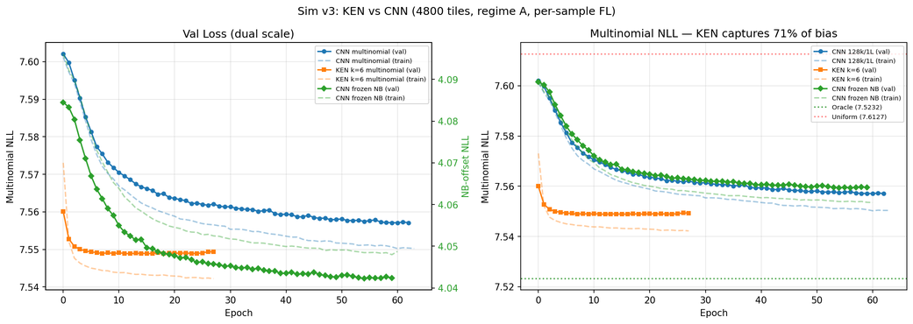

| Model | Architecture | Params | Best Multinomial NLL | Epochs | Bias Captured |
|-------|-------------|--------|---------------------|--------|---------------|
| **KEN k=6** | Embedding + 2×Conv1d | **503K** | **7.5489** | 28 (ep 12) | **71.3%** |
| CNN 128k/1L | Dilated ResNet | 1.2M | 7.5587 | 44 (ep 43) | 60.3% |
| CNN 128k/1L (frozen NB) | Dilated ResNet | 1.2M | 7.5606 | 42 (ep 39) | 58.2% |
| Oracle | — | — | 7.5232 | — | 100% |
| Uniform | — | — | 7.6127 | — | 0% |

The **K-mer Embedding Network (KEN)** captures **71.3%** of the hexamer bias —
+11pp over the CNN with 2.4x fewer parameters. This confirms the architecture
bottleneck hypothesis: the CNN's dilated convolutions can SEE the hexamer
context (496bp receptive field) but cannot efficiently ENCODE the combinatorial
4,096-entry lookup table. The KEN's `nn.Embedding(2080, 64)` with RC weight
tying IS the lookup table.

**Key observations:**
- KEN converges faster (best at epoch 12 vs CNN's epoch 43)
- KEN's train-val gap is tighter — less overfitting despite fewer parameters
- The remaining 29% gap to oracle is likely the GC×FL bias that the KEN's
  15bp context window (2× Conv1d k=15) cannot capture — fragments are
  40–175bp, far beyond the 29bp receptive field of the context layers
- CNN multinomial and frozen NB are nearly identical (7.5587 vs 7.5606),
  confirming loss choice doesn't matter for shape learning

### 7.3 Oracle Computation Fix

The v3 oracle required fixing two bugs in `compute_true_propensity`:
1. **Center-crop offset:** propensity was computed at positions [0:2048] but
   counts are center-cropped to [128:2176] within the 2304-wide region
2. **Strand endpoint swap:** "first"/"last" are strand-independent in the
   store, but the oracle was swapping them for minus-strand (the dominant bug,
   ~0.08 nats of misalignment)

Fixed oracle script: `scripts/sim_oracle.py` (~150s on CPU).

#### Independent re-verification (2026-09-23)

The oracle was recomputed from scratch and **reproduced to 4 decimal places**
(7.523195 / 7.612705 / 0.089511). Three additional checks were added:

| Check | Result |
|---|---|
| Alignment by shift-correlation (propensity vs counts, shifts −260…+260) | argmax at **shift 0**, r=0.381; r=0.027 at shift −128 |
| Dataset crop | `BackgroundTileDataset(val, train_mode=False).y` byte-identical to `y_full[:, 128:2176]` |
| Uniform vs an independent observation | computed 7.6127054755 vs 7.6127061844, **delta −7.1e−07** |

The shift-correlation is the meaningful test: the 128-offset bug of §7.3 would
have shown up as r=0.027 instead of 0.381, so it is definitively fixed rather
than merely believed fixed.

The independent uniform observation is `lrsweep_ken_lr2e-2`, a run that
collapsed to constant output in epoch 0 and then reported a bitwise-identical
val_loss for 16 epochs. A constant-output model *is* the uniform model, so its
frozen loss is an unbiased read of the uniform anchor — obtained by accident.

**Why uniform (7.6127) sits below log(2048) = 7.624619:** the frozen loss
divides each track's NLL by `N.clamp(min=1)`, so a zero-count track contributes
exactly 0 and pulls the (pair, track) mean down. About 0.16% of the 7680×12
cells are empty. The store's `tiles/mask` is all-True, so masking plays no part.

Anchors and full provenance: `simulation_v3/A/oracle.json`.

#### Regime finding: v3_A is multinomial, NOT NB-simulated

Despite the per-hexamer NB sampler existing in the simulator (commit `e27a6b8`),
**store A was not built with it**:

- `ground_truth.npz` has no `hexamer_r` key
- `ground_truth.json` has no `nb_dispersion` field
- `sample_000` fragments-per-region equals `target_counts` **exactly** for all
  4800 regions — only `simulate_sample` (multinomial) does this;
  `simulate_sample_nb` randomises per-region totals

Two consequences, pulling in opposite directions:

1. **The oracle is stronger than advertised.** The propensity is the exact
   generative categorical distribution, not an expectation over an
   overdispersed process. The floor is a true floor.
2. **The simulation is easier than real data.** There is no overdispersion at
   all. Percentages below are an *upper bound* on real-data performance, not a
   transfer estimate. See §9.

### 7.4 Learning-Rate Sweep and the Hybrid Architecture

Eight runs on `sim_store_v3_A`, multinomial loss, seed 1337, B=512, bf16-mixed,
dropout=0, `--min-N 0`, across three architectures.

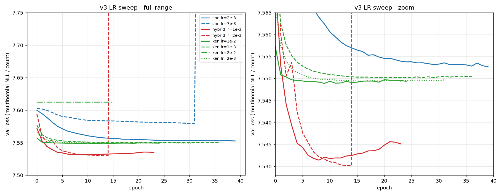

| Run | Model | LR | Best NLL | Best ep | Bias captured | Outcome |
|---|---|---|---|---|---|---|
| `lrsweep_hybrid_lr2e-3` | hybrid | 2e-3 | 7.530183 | 13 | 92.2% | **diverged ep15** — pre-div min |
| `lrsweep_hybrid_lr1e-3` | hybrid | 1e-3 | 7.531432 | 8 | **90.8%** | stable ✅ |
| `lrsweep_ken_lr1e-2` | ken | 1e-2 | 7.548897 | 9 | 71.3% | stable |
| `lrsweep_ken_lr2e-3` | ken | 2e-3 | 7.549372 | 16 | 70.8% | stable |
| `lrsweep_ken_lr1e-3` | ken | 1e-3 | 7.550209 | 21 | 69.8% | stable |
| `lrsweep_cnn_lr2e-3` | cnn | 2e-3 | 7.552690 | 39 | 67.0% | **not converged** (ep 39/40) |
| `lrsweep_cnn_lr7e-3` | cnn | 7e-3 | 7.579552 | 31 | 37.0% | **diverged ep31** — pre-div min |
| `lrsweep_ken_lr2e-2` | ken | 2e-2 | 7.612706 | 0 | — | **DEAD — this *is* uniform** |

**The hybrid architecture captures 90.8% of available bias — +19.5pp over
KEN.** The three architectures form clean, non-overlapping bands (hybrid ≈7.530,
ken ≈7.549, cnn ≈7.553). Both hybrid LRs reach the same floor by different
trajectories and all three healthy KEN LRs converge to within 0.0013 nats of
each other, so the between-architecture separation is systematic, not noise.
Hybrid vs KEN is 0.0187 nats = **21 points of the available gap**.

The LR sweep also improved the CNN over §7.2: lr=2e-3 reaches 67.0% where
lr=5e-3 reached 60.3%. KEN's optimum is unchanged at 71.3%.

**Caveats — three of the eight runs failed, and two headline numbers are soft:**

- **Quote hybrid as 90.8%, not 92.2%.** The 92.2% is the pre-divergence minimum
  of a run that blew up at epoch 15. It is a real measurement but of an unstable
  trajectory; the stable lr=1e-3 run is the defensible number. Hybrid's best LR
  sits right at the stability edge, and 2e-3 buys only 0.0012 nats over 1e-3 at
  the cost of a divergence — a schedule that can *back off* from the stability
  edge rather than terminate at it is the obvious next move (§7.6).
- **CNN's 67.0% is a lower bound.** Its best checkpoint is at epoch 39 of 40; it
  never triggered early stopping and was still descending.
- **The comparison remains confounded.** The architectures differ in capacity
  (cnn 128k/1L, ken 512k/2L, hybrid 128k/3L) *and* epoch budget (hybrid 25,
  cnn/ken 40). The separation is far above noise, but attributing it purely to
  architecture would over-claim.

#### Failure modes this sweep exposed

Reading the eight `summary.json` files gave eight plausible `best_val_loss`
numbers. Only plotting the curves revealed that **three runs had failed**. Two
diverged (caught by `DivergenceStop`, each recording its pre-divergence minimum)
and one collapsed to constant output in epoch 0, recording `best_val_loss:
7.6127` — the uniform baseline dressed as a model result, which would have
entered the comparison table silently.

The collapse was invisible to every existing guard: the loss never rose, so the
divergence check never fired, and `EarlyStopping(patience=15)` had not yet acted
by epoch 16. Measured across 15 v3 runs, healthy runs never repeat a val_loss
more than **2** times consecutively; the dead run repeated it **16** times.

Two fixes landed:

- `db45699` — stall detection in `DivergenceStop` (`--stall-patience`, default
  5, exact float equality, 0 disables). Deliberately *not* an epsilon test —
  that would duplicate `EarlyStopping` and risk firing on slow convergence.
- `2d4cc95` — `summary.json` now records **why** a run stopped
  (`completed` / `early_stopped` / `diverged` / `stalled` / `non_finite`, each
  with payload), so a run is self-describing without plotting curves. Also moved
  the non-finite check first: `inf == inf` is True, so repeated `inf` with
  `--divergence-factor 0` was being mislabelled as a stall.

Both are forward-looking — the eight runs above predate them and cannot be
backfilled.

### 7.5 The NB transfer test was abandoned — the loss cannot see it

§9 previously listed "rebuild a v3 store with the per-hexamer NB sampler and
rerun hybrid vs KEN" as the highest-value next experiment, on the reasoning that
v3_A has no overdispersion (§7.3) and real cfDNA does. A pre-flight check
**falsified the premise before the store was built**, on two independent grounds.

**1. The effect size is negligible at our counts.** Measured, not assumed:

| Quantity | Value |
|---|---|
| Pooled NB dispersion, real store | r = 9.15 |
| Median per-(position, track) r (Pearson method-of-moments) | 7.18 |
| Real-store Var/μ | 1.0033 |
| Var/μ if the same r is applied at *simulation* μ | 1.0417 |

That is ~4% excess variance — far too small to separate two architectures
differing by 0.0187 nats.

**2. The deeper reason: our loss is multinomial-*conditional*.** It conditions on
the per-track total N, so any simulated noise that perturbs only the **total** is
divided straight back out and is invisible to both the model and the metric. Only
**within-tile shape** variation can be learned or measured. Per-hexamer NB noise
on counts is overwhelmingly a totals effect, so it is largely invisible by
construction — the experiment would have returned "no difference" for a reason
that has nothing to do with architecture transfer.

**This is the wrong difficulty axis.** The right one is sample heterogeneity,
which changes shape and therefore survives the conditioning. §7.3's corroboration
is direct: v2 was regime B (per-sample w6 jitter, log-sd 0.286) and topped out at
41.7%; v3_A removed the jitter entirely and reaches 90.8%. **Much of that 49pp
jump is removing sample heterogeneity, not architecture.** The replacement
experiment is therefore a regime-B v3 store at log-sd 0.373 = 1/√7.18 —
a parameter change to an existing code path (`scripts/sim_fragments.py`), not new
algorithmic work.

> **Provenance gap to close.** `ground_truth.json` does **not** record
> `--real-store`, the store the fragment targets were sampled from. It was
> recovered as `bg_store_b67d7c95.zarr` only by reproducing `target_counts`
> exactly. Record it explicitly when building the regime-B store.

### 7.6 Training-loop upgrade — LR schedule and checkpoint retention

The sweep exposed a structural gap rather than a tuning problem: **there was no
LR schedule anywhere.** All three `configure_optimizers` returned a bare
`torch.optim.Adam`, so LR was constant for an entire run. That single fact
explains three of the sweep's failure shapes at once — hybrid lr2e-3 bottoming at
ep13 then diverging at ep15 (too-high *late-stage* LR), hybrid lr1e-3 bottoming
at ep8 then degrading, and cnn lr2e-3 still descending at ep39/40
(under-trained). A constant LR cannot be both fast enough early and small enough
late.

Landed (commits `7cf3c22`, `e8fecf4`, `b6e0be1`; 372 tests passing):

- **`ReduceLROnPlateau`** in all three models, factor 0.5, with a **per-group**
  `min_lr`. A scalar floor would flatten every param group to one value and
  silently destroy `dispersion_lr_scale`'s inter-group ratio; a per-group vector
  preserves it.
- **`EarlyStopping.patience` is now derived from the LR schedule** rather than
  being an independent magic number. The `--patience` flag is gone, replaced by
  `--lr-patience` (4) and `--max-lr-reductions` (3).
- **Every epoch's checkpoint is retained** (`save_top_k=-1`) plus
  `LearningRateMonitor`. The sweep kept only top-2 + last, so there were no
  per-epoch weights to reconstruct a trajectory from after the fact.

**The one real bug, and why it matters beyond this feature.** The first derived
patience formula was `lr_patience × (max_lr_reductions + 1)` — wrong by one per
reduction, because `ReduceLROnPlateau` reduces on `num_bad_epochs > patience`
(strict `>`) while `EarlyStopping` stops on `wait_count >= patience`. In a real
Lightning loop the reductions landed at epochs 6/11/16 and early stopping *also*
fired at epoch 16: **the final LR reduction received zero training epochs.** The
corrected formula is `(lr_patience + 1) × max_lr_reductions + lr_patience`
(19 for defaults, 9 for test runs).

The tests had asserted the *arithmetic* (`4 × 4 = 16`) and never the resulting
*behaviour*, so they passed against a policy that was not being honoured. The
guard is now a test that runs an actual Lightning loop and asserts the final LR
level gets `lr_patience` epochs. This is the same failure shape as §7.4's dead
run: a plausible number that no one had checked produced the intended behaviour.

### 7.7 Divergence recovery — landed, and what it cost to get right

Divergence recovery has now landed (commits `f30f09b`, `f598a36`, `0e1473c`;
395 tests passing; reviewed at grade A). On divergence the run restores the best
checkpoint, reduces the LR, and continues, bounded at 3 recoveries. Previously
hybrid lr2e-3 simply stopped at ep15 and its 0.0012-nat advantage was discarded.

Two design points are load-bearing and non-obvious:

- **The recovery counter is explicit, not inferred from the LR floor.** A floor
  cannot report a refusal: once every group sits at `min_lr`, `ReduceLROnPlateau`
  still fires its no-op reduction and resets `num_bad_epochs`, cycling forever
  while nothing changes and nothing is logged.
- **The LR reduction is applied *after* Lightning restores optimizer state.**
  `fit(ckpt_path=...)` restores `param_groups[i]["lr"]` from the checkpoint, so
  any reduction applied earlier is silently overwritten.

**Two bugs, both at the seam between two mechanisms.** Neither was caught by the
first two review rounds, and each was found only by execution:

1. *The LR ladder double-counted whenever recovery **succeeded**.* The intended
   ladder is `recovery_factor**N × original_lr`. But when a recovery attempt
   improves the global best, the best-checkpoint pointer moves onto a checkpoint
   whose stored LR is *already* reduced; Lightning restores that, and the
   from-original factor was then applied on top. Measured **1.25e-3 where 2.5e-3
   was intended** — a compounding error that fires precisely when the feature is
   working. Fixed by tracking how many recovery reductions are already baked into
   the resumed checkpoint.

2. *Recovery could push the LR below the plateau scheduler's floor.* Below the
   floor `ReduceLROnPlateau` is permanently inert — `new_lr = max(old×factor,
   min_lr)` exceeds `old_lr`, the `old_lr - new_lr > eps` assignment guard
   blocks, and `num_bad_epochs` resets every step. That is exactly the
   "a floor cannot report a refusal" pathology this feature exists to prevent,
   reintroduced through a second door. Fixed by clamping recovery to the floor
   **read off the live scheduler's `min_lrs`**, rather than recomputing
   `lr_factor ** max_lr_reductions` — a second copy of that formula is free to
   drift from the first, and that duplication is what caused the bug.

The common shape: the recovery ladder and the plateau floor agreed only by the
numerical coincidence `recovery_factor == lr_factor` and
`max_recoveries == max_lr_reductions`. Nothing enforced it. `--recovery-factor`
is now CLI-exposed, so retuning it would have broken the agreement silently.

**Reading `summary.json` for a recovered run.** Four things differ from a
straight run, and they matter when cross-referencing against the tables above:

| Field | Meaning |
|---|---|
| `recoveries[]` | One record per attempt: `attempt`, `epoch`, `pre_divergence_best`, `diverged_value`, `recovery_lr_factor`, `checkpoint` |
| `recoveries[].floor_clamped_groups` | `[{group, requested_lr, clamped_lr}]`, present **only** when the clamp actually bound — absent, not empty, otherwise |
| `stop_reason` | Now includes `diverged_unrecovered` (budget exhausted, or an attempt that trained zero epochs because `max_epochs` is absolute while `current_epoch` is restored) |
| `best_val_loss` | Tracked **globally across all attempts**, so it is not necessarily the last attempt's best |

Note the top-level `lr_factor` is the **plateau** factor, while
`recoveries[].recovery_lr_factor` is the **recovery** factor. They are different
quantities and the second was renamed specifically because conflating them
misreads the ladder. A recovered run also has a non-monotonic LR trajectory, so
`LearningRateMonitor` output should be read per-attempt rather than as one curve.

Everything above is verified behaviour of the training loop. §7.8 is the first
evidence about the model.

### 7.8 Phase 4 acceptance run — PRELIMINARY, still running

`phase4_hybrid_lr2e-3_recovery`, started 2026-09-24 03:32Z. Same config as
`lrsweep_hybrid_lr2e-3`, verified field-by-field against its `run_meta.json`,
with one deliberate change: `--max-epochs 40` instead of 25, because derived
`EarlyStopping` patience is now 19 and a 25-epoch cap would end the run on
budget before recovery could be exercised at all.

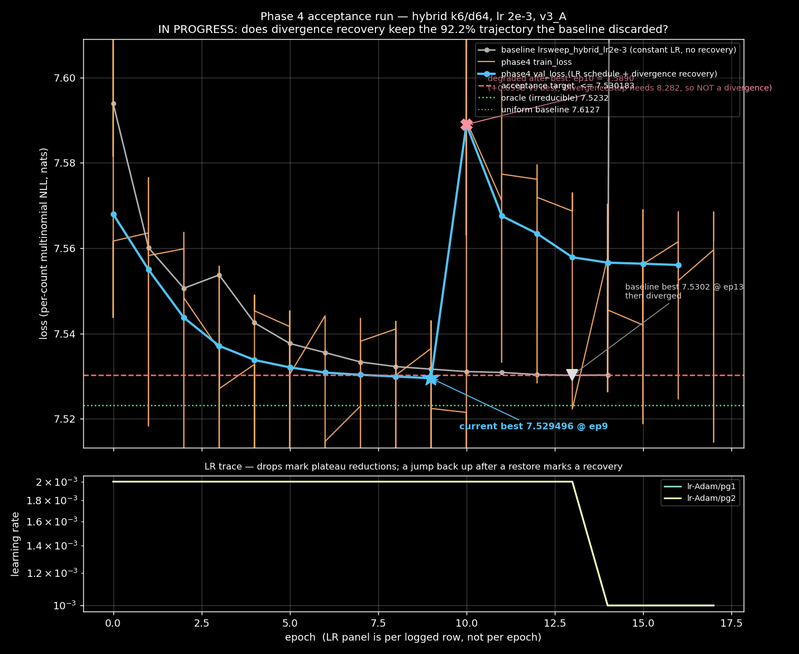

Upper panel: Phase 4 val_loss (bright blue, best starred) against the baseline
`lrsweep_hybrid_lr2e-3` (grey, its best and divergence marked), with the
acceptance target, oracle and uniform reference lines. The X marks the
post-best degradation and is annotated with the `DivergenceStop` threshold, to
make plain that it is a degradation and not a divergence. Lower panel: LR
trace on a log axis — a step down marks a plateau reduction, and a
discontinuity after a checkpoint restore would mark a recovery. Its x-axis is
logged-row index, not epoch, because `LearningRateMonitor` writes on a
different cadence than validation.

**Half the acceptance criterion is met.** Best **7.529496 at epoch 9**, against
the ≤ 7.5302 target and the baseline's 7.530183 at epoch 13. The LR schedule
reaches a better minimum, sooner, than the constant-LR baseline did.

**The run then degraded rather than diverged**, which is the more interesting
observation:

| Epoch | val_loss | |
|---|---|---|
| 8 | 7.529899 | |
| 9 | **7.529496** | best |
| 10 | 7.588997 | +0.0595 vs best |
| 11 | 7.567560 | |
| 12 | 7.563424 | |

`DivergenceStop` correctly did **not** fire: its threshold is 1.10 x best
~= 8.28, and 7.589 is far below it. This is the same "bottoms then degrades"
shape §7.6 records for hybrid lr1e-3 at ep8 — the failure mode the plateau
scheduler exists for, not the one recovery exists for.

**Caveat that governs what this run proves.** Nothing has come near the
divergence trigger, so **divergence recovery has not executed**. If the run
finishes clean we will have passed acceptance while the recovery path — the
bulk of the Phase 3 work — was never exercised on real data. Good outcome for
the model, weak test of the machinery. The Phase 3 evidence remains the
395-test suite, not this run.

**Two monitoring lessons, each of which produced a wrong statement before being
caught:**

- The **checkpoint filenames are the reliable progress record**, not the batch
  job's `stdout.log`/`stderr.log`. Python block-buffers stdout when redirected,
  so those logs sat frozen at their startup content for over an hour; grepping
  them for `[Recovery]`/`[DivergenceStop]` could not have found anything. Use
  `metrics.csv` and `checkpoints/`, whose filenames embed the monitored
  `val_loss`, and treat the batch logs as unavailable until the job exits.
- `metrics.csv` has **523 columns** because of `DeviceStatsMonitor`, and
  `LearningRateMonitor` logs on a different cadence than validation, so LR rows
  carry `epoch = NaN`. A naive `dropna()` across both columns returns empty and
  invites the conclusion that LR is not being logged at all. Select explicitly.

### 7.9 Hybrid + NB-frozen — running, first of its kind

`sim_v3_A_hybrid_nb_frozen_lr5e-3`, started 2026-09-24 04:19Z. An audit of all
16 v3 runs confirmed **no hybrid run had ever been paired with the NB loss** —
the architecture sweep (§7.4) was multinomial-only, and every NB stabilisation
experiment (§6.1–6.4) ran on 128k/1L. This closes that gap.

Config matches the `sim_v3_A_nb_frozen_128k1L` precedent (`--freeze-dispersion`,
W=1, `dispersion_lr_scale` 1.0, B=512, lr 5e-3) with the hybrid architecture
substituted. **lr 5e-3 was chosen for comparability, not stability** — the
hybrid is documented unstable at 5e-3 and NB dispersion training is unstable per
conclusion 7 — on the reasoning that the new LR schedule and recovery are
exactly what should absorb that, and that changing the LR would confound
architecture with LR.

**Read it only against `sim_v3_A_nb_frozen_128k1L` (best 4.0410).** NB and
multinomial losses are not comparable across scales. And per conclusion 8, v3_A
has no overdispersion, so this measures whether the hybrid's NB dispersion
training is *stable*, not whether NB recovers more bias.

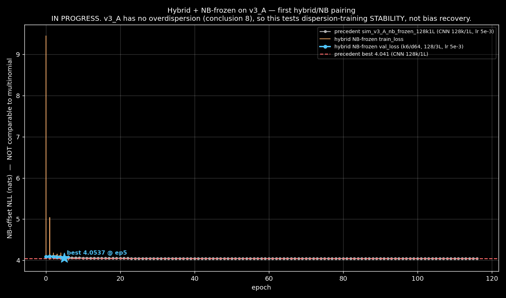

At the time of plotting: hybrid NB-frozen **6 epochs, best 4.0537**; the
precedent ran **117 epochs to 4.0410**. The two are nowhere near comparable
yet — 6 epochs against 117 — and the gap shown is almost entirely elapsed
training, not an architecture effect. Do not read a ranking off this figure
until the run converges.

**Reproducibility gap found while verifying it.** `run_meta.json` records only
28 of 36 `TrainConfig` fields. Missing: `dispersion_window_size`, `min_N`,
`fl_dist_npz`, `d_context`, `n_context_layers`, `context_kernel_size`,
`runs_root`, `resume_from`. Three of those change results — `fl_dist_npz`
changes the *loss*, `min_N` changes which tile pairs are included, and
`dispersion_window_size` changes the NB model. Consequence: the precedent's
documented "W=1" cannot be confirmed from its own metadata, and `--min-N 0` for
the Phase 4 run had to be inferred by matching `n_train_pairs = 61440` against
the baseline rather than read directly. **Runs in the tables above are
therefore not fully reproducible from their own `run_meta.json`.** Fix queued
for `_write_run_meta`.

## 8. Key Conclusions

1. **Loss function choice is secondary.** Multinomial is the best performer,
   is the simplest, and has the most stable training dynamics. DM adds nothing.
   NB-offset is noisier and recovers less bias.

2. **Model capacity is the primary lever.** Going from 1.2M to 25.4M
   parameters improved bias recovery from 29% to 40% on v2 (+11pp).

3. **Dataset size and quality matter as much as architecture.** The 128k/1L
   model jumps from 29% (v2, 1k tiles) to 60% (v3, 4.8k tiles) — a +31pp
   improvement from better data alone. Regime A (shared w6) and per-sample FL
   distributions both contribute.

4. **Positional jitter helps modestly.** +1.3pp from jitter=128 on v2.
   Included by default in v3.

5. **Architecture matters: hybrid > KEN > CNN.** The hybrid (k-mer embedding +
   conv stem into a dilated trunk) captures **90.8%**, against KEN's 71.3% and
   the CNN's 67.0%. Direct hexamer lookup beats dilated convolutions, and
   combining lookup *with* a wide-context trunk beats either alone — consistent
   with the §7.2 hypothesis that KEN's residual ~29% was GC×FL interaction its
   29bp context window could not see. Giving the lookup a larger receptive
   field recovers most of it.

6. **LR sensitivity is severe at larger model sizes.** lr=1e-3 works for
   128k/1L but causes immediate overfitting at 512k/3L.

7. **NB-offset dispersion training is unstable.** Clamping, per-base
   dispersion, and frozen pre-training all failed to match the unclamped
   best. The two-phase approach (freeze → fine-tune) is the most promising
   but hasn't been fully tested.

8. **The headline percentage is an upper bound, not a transfer estimate.**
   v3_A is multinomial with no overdispersion (§7.3). Real cfDNA counts are
   overdispersed, so 90.8% measures how much bias the hybrid recovers on a
   materially easier problem than the one that matters.

9. **Sample heterogeneity — not count overdispersion — is the difficulty axis
   that matters.** The loss is multinomial-*conditional* on per-track totals, so
   noise on the totals is divided back out and is invisible to both model and
   metric. Only within-tile *shape* variation is visible. This killed the
   NB-store transfer test and redirects it to a regime-B (per-sample w6 jitter)
   store (§7.5). Corroboration: v2 was regime B and topped out at 41.7%; v3_A
   removed jitter and reaches 90.8%.

10. **Silent run failures are a measurement risk, not just wasted GPU.** Three
    of eight sweep runs failed and all three produced plausible-looking
    `summary.json` numbers, one of which was the uniform baseline. Guards now
    record why a run stopped (§7.4).

11. **Every headline number in this study was produced by a constant LR.** There
    was no LR schedule at all until §7.6. The sweep's divergences and its
    under-trained CNN are both symptoms of that, so the architecture ranking —
    though far above noise — was measured under a handicap that has now been
    removed. Expect the absolute percentages to move when runs are repeated with
    the schedule; the question is whether the *ordering* moves.

12. **A plausible number that nobody checked behaviourally is the recurring
    failure mode here** — the uniform baseline entering the results table as a
    model result (§7.4), and the derived-patience formula that silently gave the
    final LR level zero epochs (§7.6). Both passed every check that looked only
    at the number.

13. **The defects that survive review live at the seams between mechanisms, not
    inside them.** Both §7.7 bugs were cases of two mechanisms agreeing only by
    coincidence with no enforced invariant: the recovery ladder vs. Lightning's
    checkpoint-restore, and the recovery ladder vs. the plateau floor. Two
    independent review rounds each read the relevant code and cleared it,
    because each reasoned correctly *within* one mechanism at a time — one even
    examined the exact faulty path and judged it correct. What found them was
    running the code: a measured `1.25e-3` against an intended `2.5e-3`, and a
    ten-line reproduction of the scheduler going inert below its floor. The
    durable fix in both cases was to remove the coincidence by reading the one
    authoritative source rather than recomputing a second copy of it. Related but
    distinct from conclusion 12: there the number was unchecked; here the
    *interaction* was unchecked while each side looked fine alone.

## 9. Next Steps

Ordered by what most reduces uncertainty in the result above.

- **Run the training-loop acceptance test (code landed §7.7, not yet measured).**
  Divergence recovery is implemented and reviewed; what remains is the
  experiment. Acceptance: hybrid lr2e-3 on v3_A must not end in unrecovered
  divergence *and* must reach best val ≤ 7.5302 — i.e. the schedule must keep
  the 92.2% trajectory instead of discarding it. Check `recoveries[]` and
  `stop_reason` in the resulting `summary.json` (§7.7), not just `best_val_loss`:
  a run that recovers and one that never diverged are indistinguishable from the
  headline number alone, and conclusion 10 is about exactly that failure.
- **Regime-B v3 store (highest experimental value).** Per-sample w6 jitter at
  log-sd 0.373 = 1/√7.18, replacing the abandoned NB-store test (§7.5). This is
  the axis the loss can actually see, and it is a parameter change to
  `scripts/sim_fragments.py`, not new algorithmic work. Rerun hybrid and KEN on
  it: does hybrid's +19.5pp lead survive sample heterogeneity? Record
  `--real-store` in `ground_truth.json` this time.
- **Re-measure the architecture ranking under the LR schedule.** Every number in
  §7.4 was produced at constant LR (conclusion 11). The CNN in particular was
  still descending at ep39/40, so its 67.0% is a lower bound that the schedule
  may lift. Cheap — it is the same sweep, rerun.
- **Matched comparison (optional).** Equalise parameter count and epoch budget
  across the three architectures to attribute the gap cleanly to architecture
  rather than capacity. The separation is already well above noise, so this
  sharpens a conclusion rather than establishing one.
- **Real-data training:** converged training on the production store with the
  hybrid architecture.

~~**NB-store transfer test.**~~ Abandoned — see §7.5. The premise (that
per-hexamer count overdispersion is the transfer risk) was falsified by a
pre-flight measurement: the effect is ~4% excess variance at our counts, and the
conditional loss cannot see it regardless.

## Appendix: Run Inventory

All runs at `/efs/analytics/nathanboley/background_model/simulation_v2/runs/`:

| Run Name | Loss | Model | LR | Store | Best Val | Epochs | Notes |
|----------|------|-------|----|-------|----------|--------|-------|
| `sim_v2_B_multinomial` | multinomial | 128k/1L | 1e-3 | B | 7.5750 | 21 | Baseline |
| `sim_v2_B_dirichlet_multinomial` | DM | 128k/1L | 1e-3 | B | 7.5750 | 20 | Identical to multinomial |
| `sim_v2_B_nb_offset` | nb_offset | 128k/1L | 1e-3 | B | 3.8573 | 35 | Noisy val loss |
| `sim_v2_B_multi_512k3L` | multinomial | 512k/3L | 1e-3 | B | 7.5788 | 2 | Overfitting |
| `sim_v2_B_multi_1024k3L` | multinomial | 1024k/3L | 1e-3 | B | 7.5873 | 2 | Severe overfitting |
| `sim_v2_B_multi_512k3L_lr4` | multinomial | 512k/3L | 1e-4 | B | 7.5696 | 14 | Converged, main result |
| `sim_v2_B_nb_512k3L_lr4` | nb_offset | 512k/3L | 1e-4 | B | 3.8353 | 25 | Noisy, 38% recovery |
| `sim_v2_B_multi_512k3L_jitter` | multinomial | 512k/3L | 1e-4 | B+jitter | 7.5657 | 15 | Best result: 41.7% |
| `sim_v2_B_multi_512k3L_autolr` | multinomial | 512k/3L | auto | B | 9.8224 | 1 | LR finder failed |
| `sim_v2_B_nb_512k3L_autolr` | nb_offset | 512k/3L | auto | B | 4.4656 | 1 | LR finder failed |
| `sim_v2_B_multi_512k3L_full` | multinomial | 512k/3L | 1e-3 | B | 7.5794 | 2 | Early lr=1e-3 attempt |
| `sim_v2_B_nb_512k3L_full` | nb_offset | 512k/3L | 1e-3 | B | 4.4664 | 2 | Early lr=1e-3 attempt |
| `sim_v2_B_multi_512k3L_preload3` | multinomial | 512k/3L | 1e-3 | B | 7.5781 | 2 | GPU util test |
| `sim_v2_B_multi_512k3L_b128_nw0` | multinomial | 512k/3L | 1e-3 | B | 7.5789 | 2 | B=128, nw=0 test |
| `sim_v2_B_nb_512k3L_clamped` | nb_offset | 512k/3L | 1e-4 | B | 4.4628 | 18 | Clamped, B=64, flat |
| `sim_v2_B_nb_512k3L_clamped_B512` | nb_offset | 512k/3L | 1e-4 | B | 4.3713 | 5 | Clamped, B=512 |
| `sim_v2_B_nb_128k1L_clamped_B512` | nb_offset | 128k/1L | 1e-4 | B | 4.2949 | 30 | Clamped, B=512 |
| `sim_v2_B_nb_128k1L_clamped_B2048` | nb_offset | 128k/1L | 1e-4 | B | 3.9015 | 30 | Clamped, B=2048, near-best |
| `sim_v2_B_nb_128k1L_frozen_disp_w1` | nb_offset | 128k/1L | 5e-3 | B | 4.4639 | 40 | Frozen disp, W=1, best shape (r=0.318) |
| `sim_v2_B_nb_128k1L_perbase_disp` | nb_offset | 128k/1L | 5e-3 | B | 4.4684 | 79 | Per-base disp W=1, r≈34 |

v3 runs at `/efs/analytics/nathanboley/background_model/simulation_v3/runs/`:

| Run Name | Loss | Model | LR | Store | Best Val | Epochs | Notes |
|----------|------|-------|----|-------|----------|--------|-------|
| `sim_v3_A_multinomial_128k1L` | multinomial | 128k/1L | 5e-3 | v3_A | 7.5587 | 44 | 60.3% bias captured |
| `sim_v3_A_nb_frozen_128k1L` | nb_offset | 128k/1L | 5e-3 | v3_A | 4.0435 | 42 | Frozen disp W=1, 58.2% |

LR sweep (2026-09-23), all multinomial, B=512, seed 1337, `--min-N 0`:

| Run Name | Model | LR | Best Val | Best ep | Bias | Outcome |
|----------|-------|----|----------|---------|------|---------|
| `lrsweep_hybrid_lr1e-3` | hybrid k6/d64, 128k/3L | 1e-3 | 7.531432 | 8 | **90.8%** | stable — best trustworthy result |
| `lrsweep_hybrid_lr2e-3` | hybrid k6/d64, 128k/3L | 2e-3 | 7.530183 | 13 | 92.2% | diverged ep15 (pre-div min) |
| `lrsweep_ken_lr1e-2` | ken 512k/2L | 1e-2 | 7.548897 | 9 | 71.3% | stable |
| `lrsweep_ken_lr2e-3` | ken 512k/2L | 2e-3 | 7.549372 | 16 | 70.8% | stable |
| `lrsweep_ken_lr1e-3` | ken 512k/2L | 1e-3 | 7.550209 | 21 | 69.8% | stable |
| `lrsweep_cnn_lr2e-3` | cnn 128k/1L | 2e-3 | 7.552690 | 39 | 67.0% | not converged (ep 39/40) |
| `lrsweep_cnn_lr7e-3` | cnn 128k/1L | 7e-3 | 7.579552 | 31 | 37.0% | diverged ep31 (pre-div min) |
| `lrsweep_ken_lr2e-2` | ken 512k/2L | 2e-2 | 7.612706 | 0 | — | **collapsed ep0 — equals uniform, not a result** |
